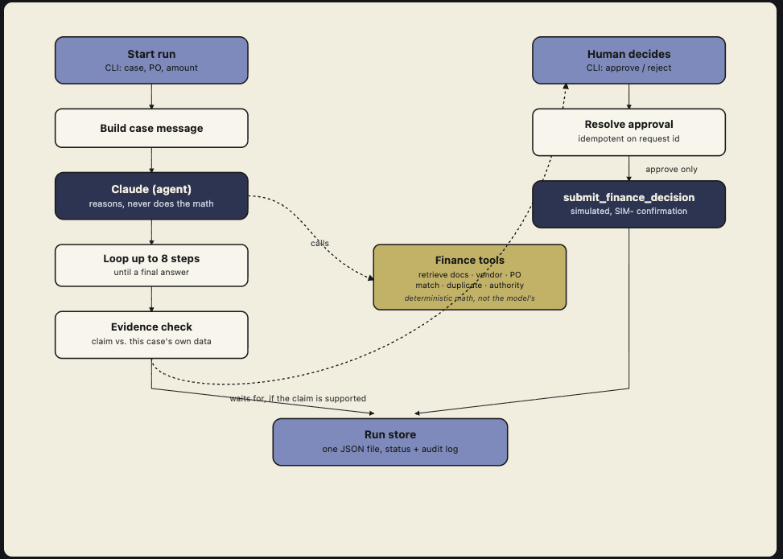

# Design

## How it's put together

This doesn't use an off-the-shelf "AI agent framework." 
The project is small enough that a framework would hide the important decisions instead of showing them. All of it is written as plain, readable code instead of hidden inside a library.

- **The agent can't run forever.** It gets a maximum of 8 turns. Each turn it either asks to use a tool or gives a final answer.
- **The agent cannot submit a payment on its own.** The tool that actually posts a decision isn't even given to the agent as an option — it's left out of its tool list entirely.
- **Nothing gets approved without a checkpoint.** The AI's final answer always says what it thinks should happen. If it says "no action needed," the case just closes.

## RAG

- Each policy document is broken up by its section headings. Every piece keeps track of which document it came from, its version, when it took effect. In total: 15 documents, 58 pieces.
- If a Voyage API key is available, the chunks are matched using cosine similarity. If not, it falls back to a keyword-matching search.
- With only 58 pieces of text, searching through all of them directly is instant. A specialized search database would be overkill here.
- A few documents in the collection are outdated or untrustworthy. These aren't hidden or removed. 
The agent is instead told to check how current and trustworthy a document is and to flag anything suspicious it finds inside a document's content.

## What's trusted vs. not trusted

- **Trusted:** the structured case details (case ID, invoice number, vendor, purchase order number, amount, currency) — these come from the system that submitted the case.
- **Not trusted:** any free-text notes and anything pulled from documents.
- Before any approval is offered, a separate check re-verifies everything using the actual tool results. 
For an approval to go through, it specifically needs:
- the matching check to say everything lines up for the right purchase order
- the duplicate check to come back clean for the right vendor and invoice
- the vendor to be in good standing
- the authorization check to have actually run.

## What the agent can and can't do

The agent has access to six "read-only" lookup tools — things like searching documents, checking a vendor, pulling up a purchase order, checking invoice history and running the matching/authorization calculations. 
A tool that actually submits a decision is kept separate and is only used after a human approves.

All the  rule-checking (matching totals, checking for duplicates, authorization limits) is built in to the code.

## How information is saved

Each case is saved as its own file.

## What happens when things go wrong

| What goes wrong | What happens |
|---|---|
| A lookup takes too long (e.g. purchase order lookup) | Reported as "timed out." The agent retries once, then holds off. No approval can go through without a confirmed match. |
| A lookup fails unexpectedly | Caught and passed back as a failed result; the case keeps going. |
| The agent's answer isn't formatted right | One chance to fix it. Fails again → case ends as "bad output." |
| The agent recommends something the evidence doesn't support | Case ends immediately with the reason and the contradicting proof. Nothing gets sent for approval. |
| The agent service itself fails | Case is marked failed, with the error recorded. |
| Someone tries to approve the same thing twice | The repeat is recognized and ignored — original result stands. A different decision or approver isn't accepted. |
| The app restarts | Finished cases reload as-is. A case stuck mid-process restarts from the beginning. |

## Testing results

The full test set was run 4 separate times using the AI model: all 20 test cases passed, every time.
Each type of case consistently reached the expected outcome — approve, reject as duplicate, escalate for review, or hold for more info.

## What I'd improve for a real production system

- Add telemetry — logging and metrics on things like approval latency, how often each outcome happens, retrieval mode usage, tool failures, and step-budget exhaustion.
- Deploy to a real AWS environment instead of running locally — e.g. the app on ECS/Fargate or Lambda, run files moved to S3 or a managed database (RDS/DynamoDB) instead of local JSON files, secrets (API keys) in Secrets Manager instead of env vars, and logs/metrics wired into CloudWatch.
- Add unit tests for the core logic. 
- Add more eval cases covering scenarios not in the current 5. 
- Save approval records to disk, not just memory, so a restart can't cause the same payment to go through twice.
- Actually verify that the person approving something has the right authority and require a second approval when policy calls for one.
- Add protection against two processes saving the same file at the same time or move to a proper database.
- If embedding search stops working in the middle of a run — for example, it gets rate-limited — automatically retry that lookup using basic keyword search instead of just returning a failure. 
Right now the search method is chosen once at startup and never switches, even if it starts failing later.
- Run every test case many more times and track how often it actually succeeds.
